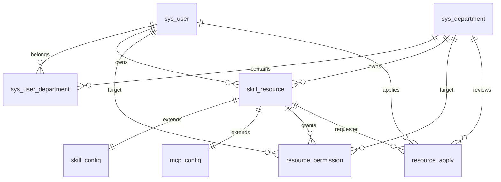

# 数据库 Schema 设计

## 设计目标

这套模型围绕两个核心问题设计：

- 如何把原本文件形态的 Skill / MCP 配置统一迁移到数据库
- 如何同时表达“谁维护”“谁可用”“谁能申请”

因此采用了“统一资源主表 + 类型详情表 + 权限表 + 申请表”的结构。

## 核心设计决策

### 1. Skill 与 MCP 统一抽象为资源

通过 `skill_resource` 作为主表，统一承载：

- 资源名称与编码
- 资源类型
- 归属范围
- 所属部门 / 所属用户
- 启用状态
- 是否需要申请

Skill 与 MCP 的差异配置分别沉淀到：

- `skill_config`
- `mcp_config`

这样可以避免两套重复的权限、启停、审计逻辑。

### 2. 归属范围与使用授权分离

- `scope_level` 解决资源归属与维护边界
- `resource_permission` 解决实际可用范围

这使系统能够同时支持：

- 公共资源全员可用
- 部门资源对整个部门开放
- 部门资源仅对审批通过的个人开放
- 个人资源仅本人可用

### 3. 部门技能申请单独建模

`resource_apply` 负责支撑“申请部门级技能”这条赛题要求，并在审批通过后转换为个人使用授权。

## ER 图

## 表说明

### `sys_user`

用户主表。

- `is_system_admin`：是否系统管理员
- `status`：用户状态

### `sys_department`

部门表。

### `sys_user_department`

用户与部门的多对多关系。

- `role_code = DEPT_ADMIN` 表示该用户是部门管理员
- `is_primary` 标识主部门

### `skill_resource`

统一资源主表。

- `resource_type`：`SKILL` / `MCP`
- `scope_level`：`PUBLIC` / `DEPARTMENT` / `PERSONAL`
- `approval_required`：部门级资源是否需要申请后使用

### `skill_config`

Skill 专属配置表，保留原始 `manifest_json` 便于从文件迁移。

### `mcp_config`

MCP 专属配置表，支持命令行、参数、环境变量和远程端点等配置。

### `resource_permission`

统一授权表。

- `target_scope = PUBLIC`：全员可用
- `target_scope = DEPARTMENT`：指定部门可用
- `target_scope = PERSONAL`：指定个人可用
- `permission_type` 预留 `USE/MANAGE` 扩展，当前版本以 `USE` 为主

### `resource_apply`

部门技能申请表。

- `PENDING`
- `APPROVED`
- `REJECTED`

审批通过后，为申请人增加一条 `PERSONAL + USE` 权限记录。

## 权限模型落库方式

### 公共级

- `skill_resource.scope_level = PUBLIC`
- 创建一条 `resource_permission(target_scope = PUBLIC, permission_type = USE)`
- 维护权限由系统管理员在服务端校验

### 部门级

- `skill_resource.scope_level = DEPARTMENT`
- `owner_department_id = 所属部门`
- 若不需要申请：创建 `DEPARTMENT + USE`
- 若需要申请：资源进入部门申请目录，审批通过后生成 `PERSONAL + USE`

### 个人级

- `skill_resource.scope_level = PERSONAL`
- `owner_user_id = 当前用户`
- 创建 `PERSONAL + USE`

## MySQL 8.0 选型说明

- 使用 `InnoDB`
- 使用 `utf8mb4`
- 时间字段使用 `datetime`
- Skill/MCP 原始配置使用 `JSON`
- 所有核心表保留 `deleted` 逻辑删除标志，便于演示和恢复

## 已提供脚本

- [V1__init_schema.sql](/Users/dengfulei/Desktop/codex-ai/skill-admin/backend/src/main/resources/db/migration/V1__init_schema.sql)
- [V2__seed_demo_data.sql](/Users/dengfulei/Desktop/codex-ai/skill-admin/backend/src/main/resources/db/migration/V2__seed_demo_data.sql)
